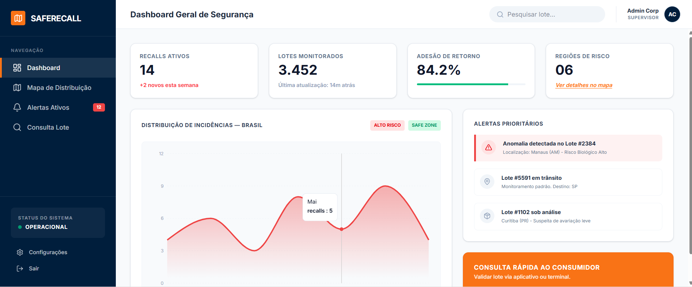
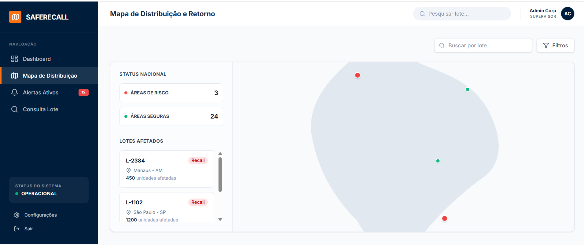
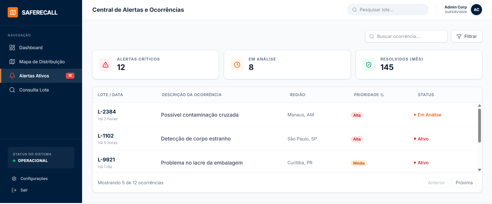
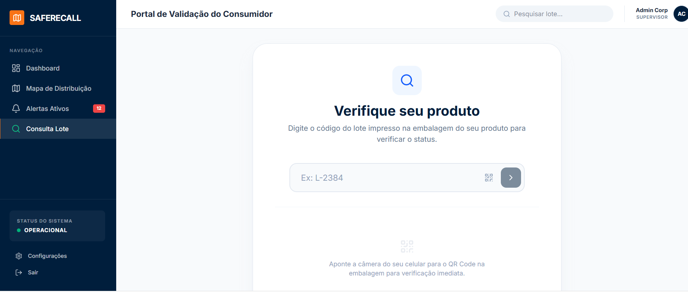

# 📦 RackAthon

## 🚀 Solução Logística para Controle Industrial

O **RACKTOOM** é uma solução inteligente de monitoramento e gestão logística desenvolvida para otimizar a rastreabilidade de lotes, agilizar a comunicação interna e externa, fortalecer o controle de qualidade e tornar a tomada de decisões mais rápida, segura e eficiente em situações de crise e recall.

---

# 🎯 Objetivo do Projeto
O projeto foi criado com base em problemas reais de logística industrial, como o caso de contaminação de lotes da Ypê em Amparo.

# Nossa proposta busca:

✅ Melhorar o rastreamento de produtos  
✅ Agilizar a identificação de lotes afetados  
✅ Reduzir prejuízos operacionais  
✅ Facilitar a retirada de produtos contaminados  
✅ Auxiliar na recuperação logística e comercial da empresa  

---

## O RACKTOOM auxilia em:

📍 Localização rápida de lotes  
📦 Controle e organização do estoque  
⚡ Agilidade na retirada de produtos  
💸 Redução de desperdícios  
🛡️ Mais segurança para consumidores e empresas  

---

# ⚙️ Como Funciona

O sistema realiza:

1️⃣ Cadastro e monitoramento de lotes  
2️⃣ Controle inteligente de estoque  
3️⃣ Rastreamento rápido de produtos  
4️⃣ Alertas automáticos de risco  
5️⃣ Localização precisa dos lotes afetados  

---

# 💡 Diferenciais da Solução

✅ Dashboard em tempo real  
✅ Busca rápida de lotes  
✅ Alertas inteligentes  
✅ Controle logístico eficiente  
✅ Interface intuitiva  
✅ Tomada de decisão mais rápida  

---

# 🚀 Impactos do Projeto

⚡ Até **95% mais rapidez** na localização de lotes  
💰 Redução de até **78% nos prejuízos operacionais**  
🏪 Reposição mais rápida nos mercados  
📦 Melhor organização logística  
📈 Recuperação mais rápida da imagem da empresa  
🤝 Mais confiança dos consumidores  

---

# 📸 Telas do Protótipo

# 📊 Dashboard

---

# 🔎 Busca de Lotes

---

# 🚨 Alertas Inteligentes

---

# 📦 Controle de Estoque

---

# 🛠️ Tecnologias Utilizadas

- 🎨 Canva
- 💻 Desenvolvimento de Sistemas

---

# 👥 Equipe

- Mirella Brolezi
- Davi Moratorio
- Ítalo Mozer
-  Matheus Spinelli
- Miguel Gerbi
